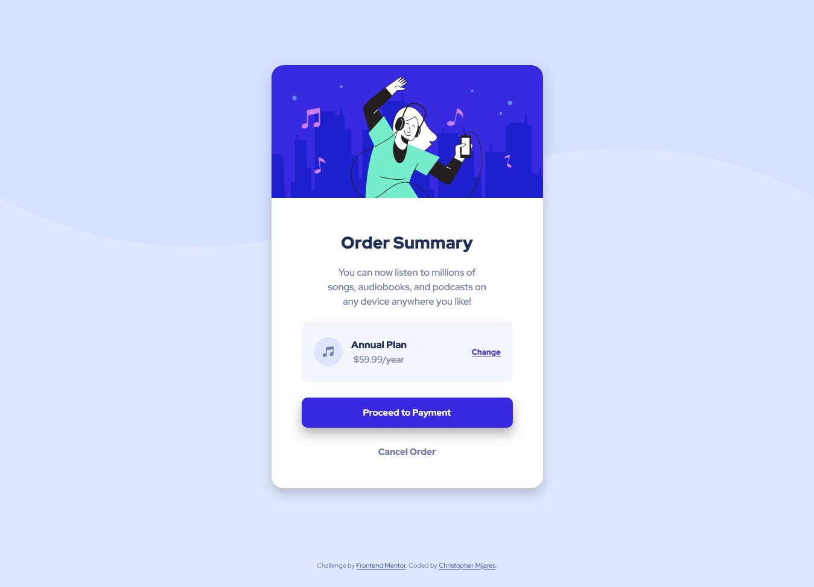

# Frontend Mentor - Order summary card solution

This is a solution to the [Order summary card challenge on Frontend Mentor](https://www.frontendmentor.io/challenges/order-summary-component-QlPmajDUj). Frontend Mentor challenges help you improve your coding skills by building realistic projects. 

## Table of contents

- [Overview](#overview)
  - [The challenge](#the-challenge)
  - [Screenshot](#screenshot)
  - [Links](#links)
- [My process](#my-process)
  - [Built with](#built-with)
  - [Useful resources](#useful-resources)
- [Author](#author)

## Overview

### The challenge

Users should be able to:

- See hover states for interactive elements

### Screenshot

### Links

- Solution URL: [https://www.frontendmentor.io/solutions/order-summary-component-solution-NsEaNXAPDv](https://www.frontendmentor.io/solutions/order-summary-component-solution-NsEaNXAPDv)
- Live Site URL: [https://myordersummarysolution.netlify.app/](https://myordersummarysolution.netlify.app/)

## My process

### Built with

- Semantic HTML5 markup
- CSS custom properties
- CSS BEM
- Flexbox
- Mobile-first workflow

### Useful resources

- [Perfect Pixel](https://www.welldonecode.com/perfectpixel/) - It's useful for comparing your design with the one you want to replicate, so you can adjust the details to get as close as posible.
- [CSS Matic](https://www.example.com) - Their box-shadow generator helped me making it easier to style the container and the payment button

## Author

- Frontend Mentor - [@cemijares23](https://www.frontendmentor.io/profile/cemijares23)
- Instagram - [@cmijares23](https://www.instagram.com/cmijares23)